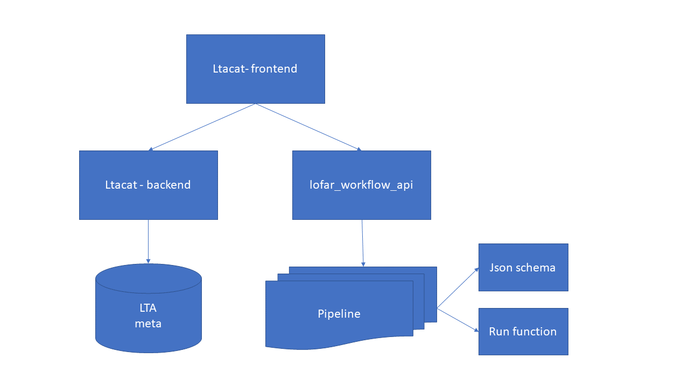

# Lofar Long Term Archive pipeline orcestrate web application

This project has been continued as part of [PROCESS](https://github.com/process-project/ltacat).

The is the frontend and the db backend of the web application which can be used to run a pipeline on several data products in the Lofar Long Term Archive.
To run pipeline the https://github.com/EOSC-LOFAR/lofar_workflow_api web service is required.




### Dependencies:

  - oracle instantclient basic (tested with version 18.3)
  - npm
 
### Configuration:

To run the following variables must be set in server/db-config.js before building the package:
* HR_CONNECTIONSTRING, connection string to Lofar database (optional)
* HR_USER, username to connect to Lofar database
* HR_PASSWORD, password to connect to Lofar database

### Installation:
To install frbcat-web, please follow the following steps. First we need to install the dependencies of frbcat-web using the following commands:
```
  npm ci
```
Next, we build the package using:

```
  npm run webpack
```

### Running the express server with ltacat:
To start the express server with frbcat-web loaded use the following command:
```
npm run start
```

To run both backends (ltacat and [lofar_workflow_api](https://github.com/EOSC-LOFAR/lofar_workflow_api)) behind the same server use [CaddyServer](https://caddyserver.com/) by running it in root of this repo with:
```
caddy
```

The web application is running at http://localhost:2015 after running CaddyServer.
